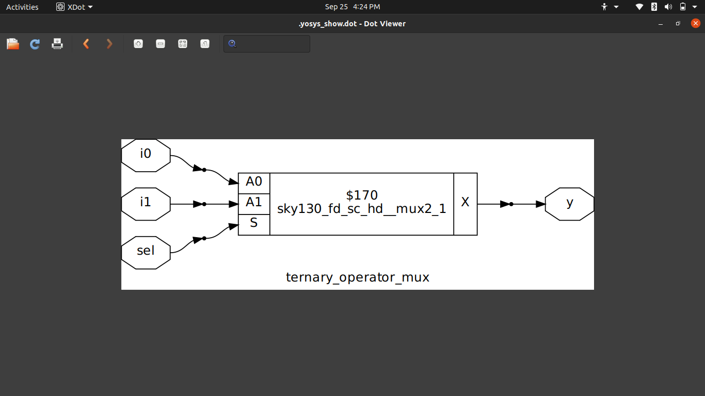
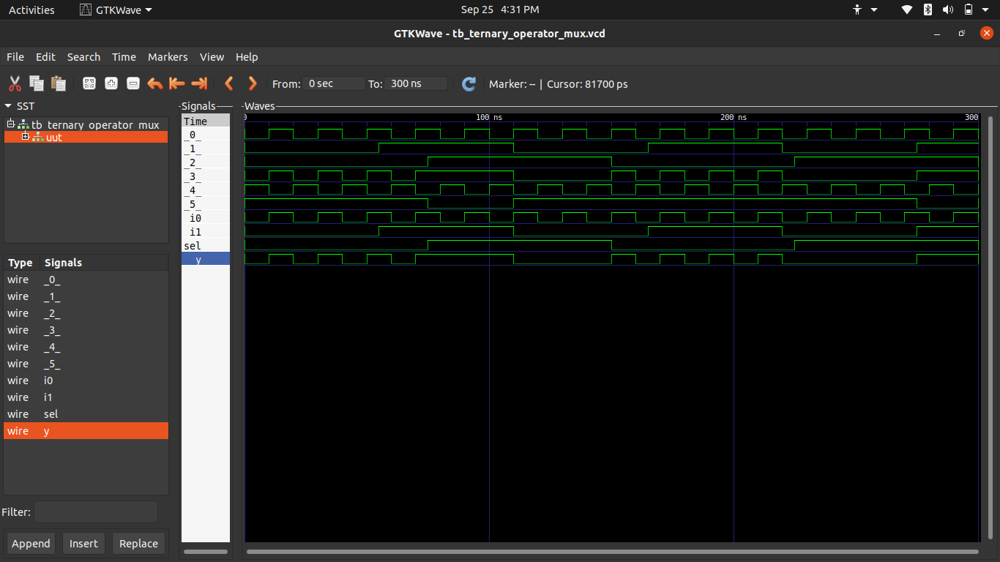
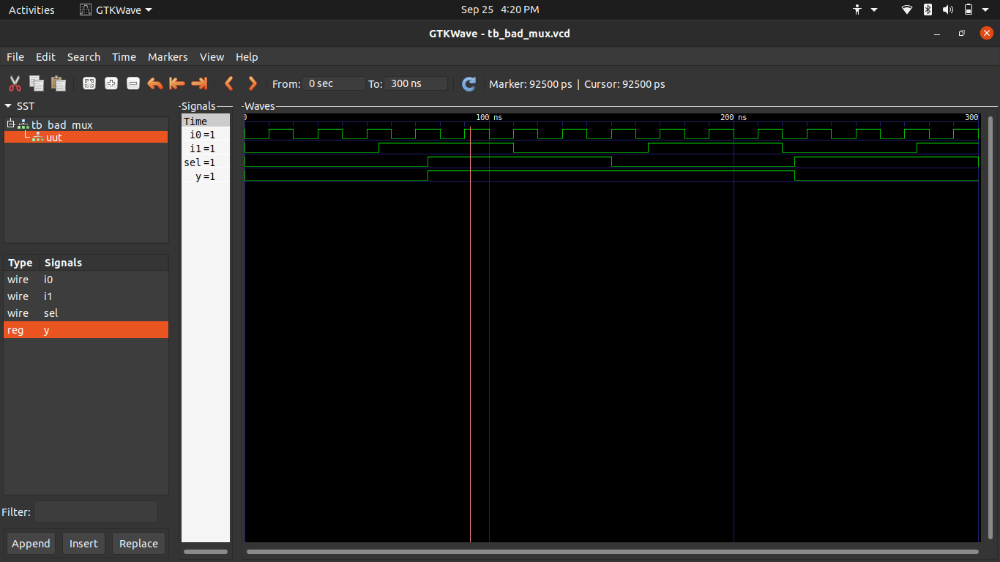
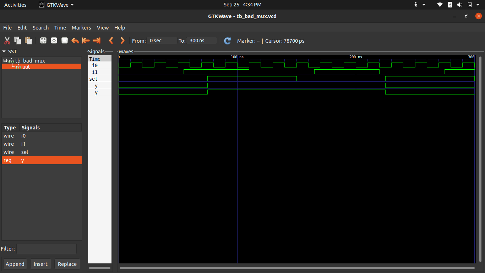
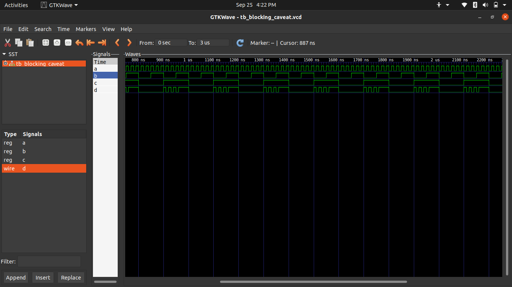
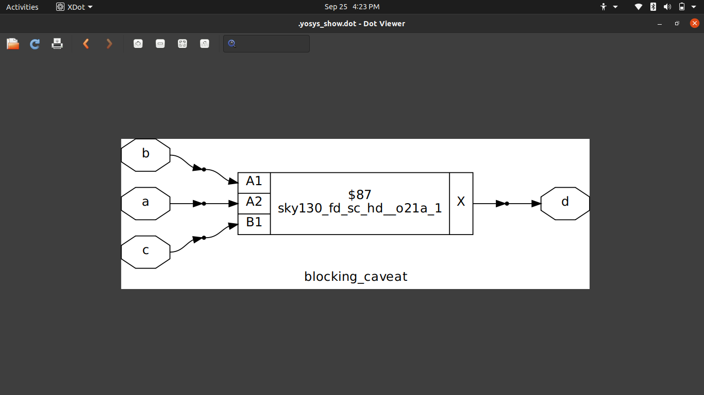

# Day 4: Gate-Level Simulation, RTL-to-Gates Flow, and Debugging Synthesis Mismatches

Welcome to **Day 4** of the **RISC-V SoC Tapeout Program**.  
In this session, we dive deeper into the verification flow after synthesis and understand how **RTL transforms into gates** using standard cell libraries. We will also analyze **common pitfalls** and how to debug mismatches effectively.

---

##  Topics Covered
1. Gate-Level Simulation (GLS) in the SoC design flow  
2. RTL-to-Gates: How Yosys + Liberty + Verilog models connect  
3. Synthesis-Simulation mismatches and their real causes  
4. Delay annotation and functional vs timing simulations  
5. Hands-on labs with practical case studies  

---

## 1️ Gate-Level Simulation (GLS)

GLS is the process of simulating the **post-synthesis netlist** generated from your RTL.  
Unlike pure RTL simulation, GLS validates the design against **realistic hardware cells** from the PDK.

 **Why GLS is important:**
- Ensures the netlist generated by synthesis tools preserves RTL behavior.  
- Exposes bugs due to incomplete coding, inferred latches, or wrong assumptions.  
- Allows timing verification (when SDF delays are back-annotated).  
- Confirms the integration of standard cells from **Sky130** library into your design.  

 **Types of GLS**:
- **Zero/Unit Delay GLS** → Quick functional check (no real timing).  
- **SDF Timing GLS** → Real-world delay simulation with annotated `.sdf` files.  

---

## 2️ RTL → Gates Flow

The process from RTL to gates can be summarized as:

RTL (Verilog) → Yosys Synthesis → Netlist (with Sky130 Cells) → Gate-Level Simulation


- **RTL (Behavioral Design):** Human-readable hardware description.  
- **Yosys Synthesis:** Optimizes logic, maps it to available standard cells in `.lib`.  
- **Netlist:** Structural Verilog composed of gates from `sky130_fd_sc_hd.v`.  
- **Simulation:** Done using `iverilog` with standard cell models.  

---

## 3️ Synthesis-Simulation Mismatch

Sometimes the RTL sim and GLS sim give different results. Reasons include:  

-  **Non-synthesizable constructs**: `#delays`, `initial`, `$display`.  
-  **Incomplete sensitivity list**: Missing signals in `always @(...)`.  
-  **Latch inference**: If variables aren’t assigned in all branches.  
-  **Tool interpretation differences**: Yosys vs Icarus may optimize differently.  

 **Golden Rule:** Write **synthesizable, deterministic RTL** with full coverage.  

---

## 4️ Delay Annotation (SDF Basics)

In real silicon, gates don’t switch instantly. GLS can include **Standard Delay Format (SDF)** files that capture:  
- Gate delays  
- Setup/Hold timing checks  
- Interconnect delays  

For now, we focus on **functional GLS (no SDF)**, but in tapeout, timing GLS is crucial for **sign-off**.

---

## 5️ Labs

###  Lab 1: Simple MUX GLS
- Write a 2:1 mux in RTL.  
- Synthesize using Yosys → netlist.  
- Run GLS with:
  ```
  iverilog primitives.v sky130_fd_sc_hd.v mux_netlist.v tb_mux.v -o gls_mux
  vvp gls_mux
  gtkwave tb_mux.vcd
```
```
Lab 2: D-Flipflop GLS

RTL: always @(posedge clk) q <= d;
Synthesize the above MUX using Yosys.
Follow the standard Yosys synthesis flow.

Check GLS output waveform vs RTL.

Observe how reset and initialization differ in GLS.


 Lab 3:Lab 3: Gate-Level Simulation (GLS) of MUX
Run GLS for the synthesized MUX.
Use this command (adjust paths as needed):
```
iverilog /path/to/primitives.v /path/to/sky130_fd_sc_hd.v ternary_operator_mux.v testbench.v
```

Fix the RTL → verify again with GLS.


 Lab 4:  Bad MUX Example (Common Pitfalls)
Verilog code with intentional issues:
```verilog
module bad_mux (input i0, input i1, input sel, output reg y);
  always @ (sel) begin
    if (sel)
      y <= i1;
    else 
      y <= i0;
  end
endmodule
```
Issues:

    Incomplete sensitivity list: Should include i0, i1, and sel.
    Non-blocking assignment in combinational logic: Should use blocking assignments (=).

Corrected version:
```verilog
always @ (*) begin
  if (sel)
    y = i1;
  else
    y = i0;
end
```


Lab 5: GLS of Bad MUX
Perform GLS on the bad_mux.
Expect simulation mismatches or warnings due to above issues.



Lab 6: Blocking Assignment Caveat
Verilog code:
```verilog
module blocking_caveat (input a, input b, input c, output reg d);
  reg x;
  always @ (*) begin
    d = x & c;
    x = a | b;
  end
endmodule
```
What’s wrong?

    The order of assignments causes d to use the old value of x—not the newly computed value.
    Best Practice: Assign intermediate variables before using them.

Corrected order:
```verilog
always @ (*) begin
  x = a | b;
  d = x & c;
end
```

Lab 7: Synthesis of the Blocking Caveat Module
Synthesize the corrected version of the module and observe the results.



>Key Takeaways

GLS is a must-have step before tapeout to ensure design correctness.

Functional GLS validates logical correctness; Timing GLS validates real-world behavior.

Always write synthesizable RTL to avoid hidden bugs.

Cross-check RTL vs Netlist vs GLS waveforms for confidence.

>Summary

Learned GLS concepts and flow.

Explored synthesis-simulation mismatches and fixes.

Practiced GLS on MUX and DFF modules.

Peeked into SDF-based timing simulations.

