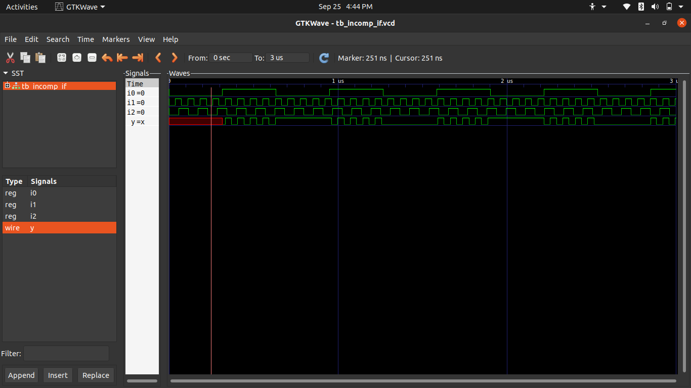
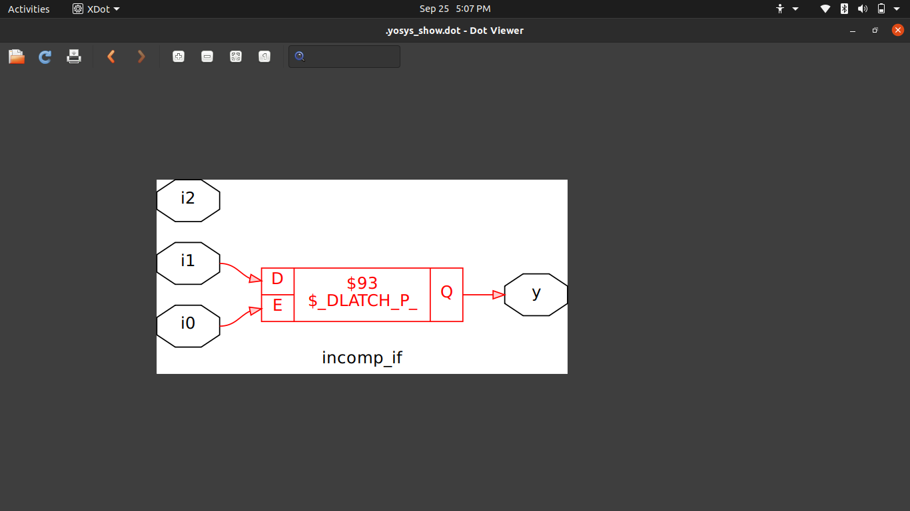
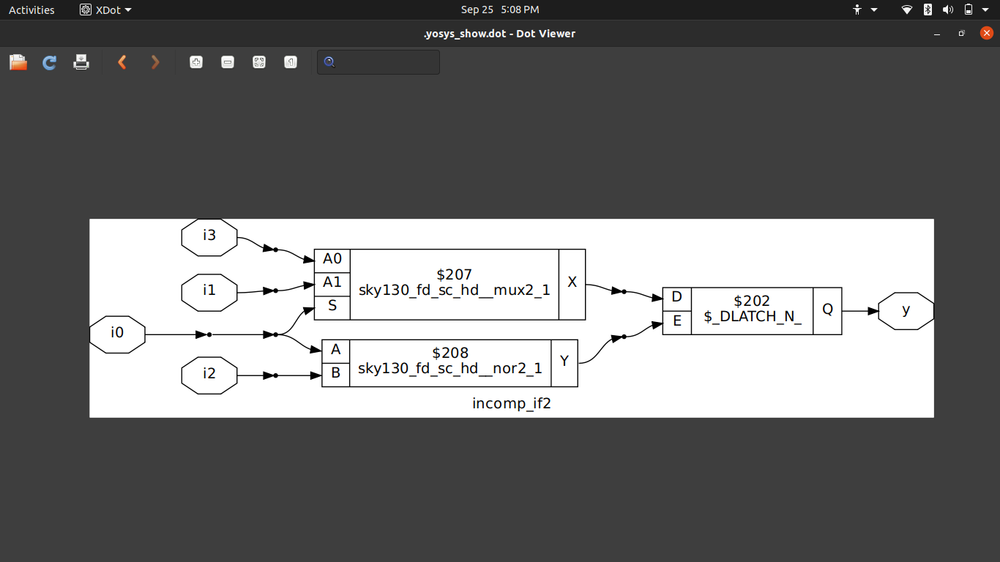
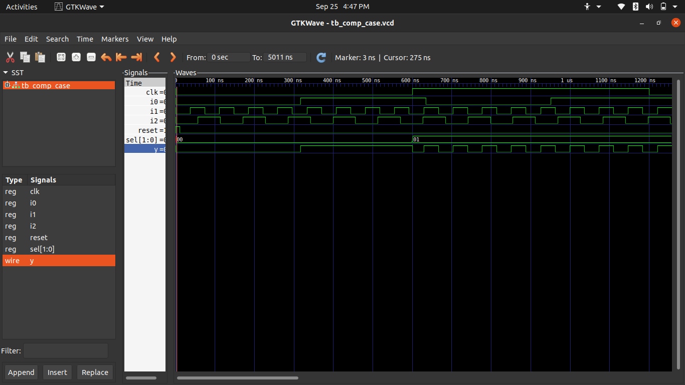
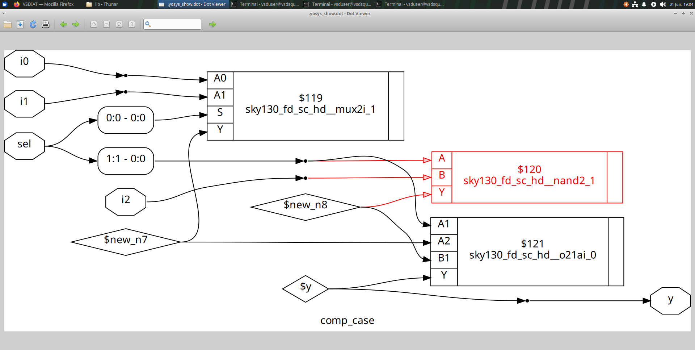
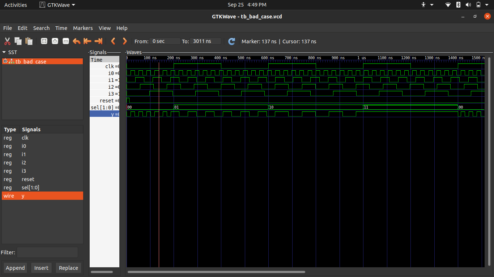
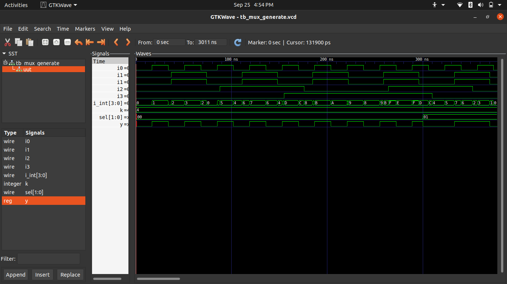
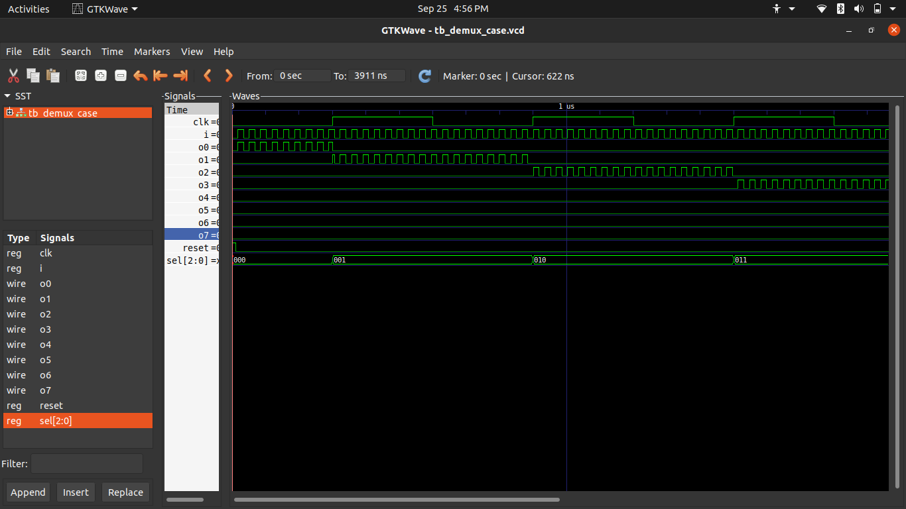
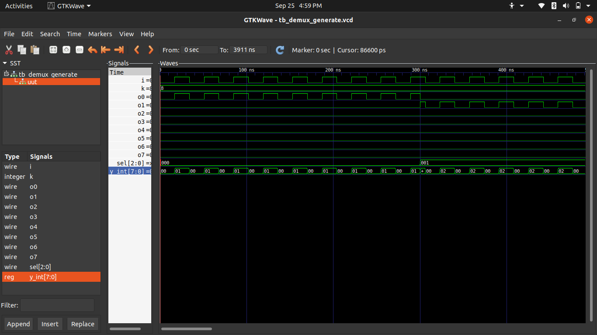
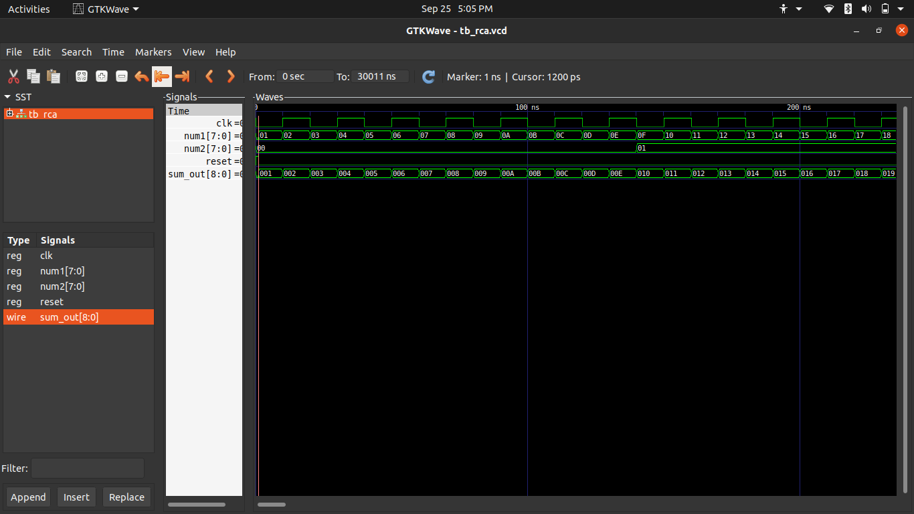

# Day 5: **Synthesis Optimization & Coding Styles**

Welcome to **Day 5** of the **RISC-V SoC Tapeout Program**! 🚀  
Today, we focus on **coding style and synthesis optimization** in Verilog.  
Key topics: **if-else constructs, case statements, for-loops, generate blocks**, and **avoiding inferred latches**.  

Hands-on labs are included to reinforce practical learning.

---

## 📖 Contents
1. Conditional Constructs in Verilog
2. Understanding Inferred Latches
3. Labs on If-Else and Case Statements
4. For-Loops in RTL Design
5. Generate Blocks in Verilog
6. Ripple Carry Adder (RCA) Design
7. Labs on Loops and Generate Blocks
8. 🔑 Key Takeaways

---

## 1. Conditional Constructs in Verilog
Conditional logic allows **decision-making** inside **procedural blocks** (`always`, `initial`, tasks, functions).  

### Syntax
```verilog
if (condition) begin
   // executed when condition is true
end else begin
   // executed otherwise
end

condition: Boolean expression

else: Optional branch

Nested else if supports multiple levels


2. Inferred Latches in RTL

A latch is inferred when a signal is not assigned in all paths in a combinational block.
This often happens with incomplete if-else or case statements.

Example

always @(a, b, sel) begin
   if (sel)
      y = a;   // Missing assignment for sel=0
end

Here, y retains the previous value for sel=0 → synthesis infers a latch.

Correct Approach
Latch Inference Flow (ASCII)
   sel?
   ├─ 1: assign y = a
   └─ 0: y retains old value → latch inferred
Add default/else to avoid latches:
   sel?
   ├─ 1: assign y = a
   └─ 0: assign y = 0  → no latch


3. Labs: If-Else & Case Statements

Lab 1: Incomplete If → incomp_if.v
module incomp_if (input i0, input i1, input i2, output reg y);
always @(*) begin
    if (i0)
        y <= i1;
end
endmodule


Lab 2: Synthesized result → incomp_synth.png

Lab 3: Nested If-Else → incomp_if2.v
module incomp_if2 (input i0, input i1, input i2, input i3, output reg y);
always @(*) begin
    if (i0)
        y <= i1;
    else if (i2)
        y <= i3;
end
endmodule
Lab 4: Synthesized netlist → incomp2synth.png

Lab 5: Proper Case Statement → comp_case.v

module comp_case (input i0, input i1, input i2, input [1:0] sel, output reg y);
always @(*) begin
    case(sel)
        2'b00 : y = i0;
        2'b01 : y = i1;
        default : y = i2;
    endcase
end
endmodule
Lab 6: Synthesized output → compcase_synth.png

Lab 7: Faulty Case → bad_case.v


module bad_case (
    input i0, input i1, input i2, input i3,
    input [1:0] sel,
    output reg y
);
always @(*) begin
    case(sel)
        2'b00: y = i0;
        2'b01: y = i1;
        2'b10: y = i2;
        2'b1?: y = i3; // '?' is a wildcard; be careful with incomplete cases!
    endcase
end
endmodule
Lab 8: Partial Assignments in Case → partial_case_assign.v
module partial_case_assign (
    input i0, input i1, input i2,
    input [1:0] sel,
    output reg y, output reg x
);
always @(*) begin
    case(sel)
        2'b00: begin
            y = i0;
            x = i2;
        end
        2'b01: y = i1;
        default: begin
            x = i1;
            y = i2;
        end
    endcase
end
endmodule
 Observation: Complete paths in combinational blocks prevent unintended latches.


4. For-Loops in RTL

for loops simplify repetitive hardware generation in procedural blocks.
Synthesizable only if loop count is fixed at compile-time.

Example: 4-to-1 MUX

always @(data, sel) begin
   y = 0;
   for (i = 0; i < 4; i = i + 1)
      if (i == sel) y = data[i];
end


5. Generate Blocks

generate blocks create hardware structures at compile time, especially for scalable modules.

Example

genvar k;
generate
   for (k=0; k<4; k=k+1) begin : gen_loop
      and_gate g(.a(in[k]), .b(in[k+1]), .y(out[k]));
   end
endgenerate


6. Ripple Carry Adder (RCA)

An RCA chains n full adders. Each stage's carry-out becomes next stage's carry-in.

RCA Structure (ASCII)
num1[0] + num2[0] + Cin -> FA0 -> sum[0], co0
num1[1] + num2[1] + co0  -> FA1 -> sum[1], co1
...
num1[7] + num2[7] + co6  -> FA7 -> sum[7], co7
Simple design

Suffers from carry propagation delay

Useful to demonstrate generate block replication

7. Labs: Loops & Generate Blocks

Lab 9: 4-to-1 MUX using For Loop → mux_generate.v

Lab 10: 8-to-1 Demux using Case → demux_case.v

Lab 11: 8-to-1 Demux using For Loop → demux_generate.v

Lab 12: 8-bit RCA using Generate → rca.v + fa.v


Each lab contains RTL code + synthesis screenshots for reference.

Key Takeaways

Always cover all possible conditions to prevent latches.

Use default in case statements for safety.

for loops + generate blocks enable scalable, efficient RTL.

RCA design highlights reusable patterns in hardware.

Optimized RTL = efficient synthesis & reliable silicon behavior.
